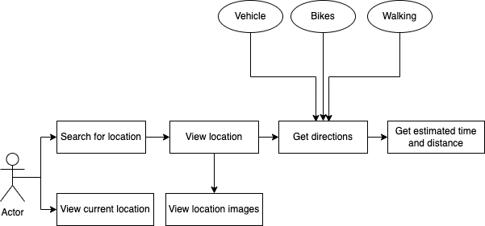

# Location Navigator Backend

Hey there! 👋🏼👋🏼👋🏼

This is the server side application that powers the mobile app used for navigation from one place to another within the University of Ibadan.
The mobile app can be accessed [here](https://github.com/Sir-Dave/Location-Navigator-App).

#### Technologies and Frameworks used:

- Kotlin 1.6.10
- Java 11
- Spring Boot
- Postgresql (database)
- Maven (build tool)

### ER Diagram

### Activity Diagram

### Use Case Diagram

### Reference Documentation

For further reference, please consider the following sections:

* [Official Apache Maven documentation](https://maven.apache.org/guides/index.html)

* [Spring Boot Maven Plugin Reference Guide](https://docs.spring.io/spring-boot/docs/2.4.5/maven-plugin/reference/html/)

* [Create an OCI image](https://docs.spring.io/spring-boot/docs/2.4.5/maven-plugin/reference/html/#build-image)

* [Spring Web](https://docs.spring.io/spring-boot/docs/2.4.5/reference/htmlsingle/#boot-features-developing-web-applications)

* [Spring Data JPA](https://docs.spring.io/spring-boot/docs/2.4.5/reference/htmlsingle/#boot-features-jpa-and-spring-data)

### Guides

The following guides illustrate how to use some features concretely:

* [Building a RESTful Web Service](https://spring.io/guides/gs/rest-service/)

* [Serving Web Content with Spring MVC](https://spring.io/guides/gs/serving-web-content/)

* [Building REST services with Spring](https://spring.io/guides/tutorials/bookmarks/)

* [Accessing Data with JPA](https://spring.io/guides/gs/accessing-data-jpa/)

